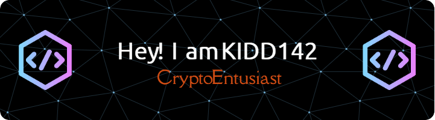

  

---

**<h3 align="center">Reach me :</h3>** 

  

 **<h3 align="center">🚀 I am a Crypto Entusiast. AIRDROP including all GIVEAWAYS, BOUNTIES, & MORE</h3>**

---

- 💼 I'm currently working on: **💻 Nodejs, Python & Typescript ❤️ projects.**
- 🌱 I'm currently learning: **📚 Nodejs & Phyton.**
- 💬 Ask me about: **💡 Actually DONT ASK ME ANYTHING!**
- ⚡ Fun fact: **🎢 Nothing!**
---
**<h3 align="left">Skills</h3>**

          

---

**<h3 align="left">GitHub Stats</h3>**

  
  

---

## 🏆 GitHub Trophies

---

### ✍️ Random Dev Quote

---

<!-- Proudly created with GPRM ( https://gprm.itsvg.in ) -->
